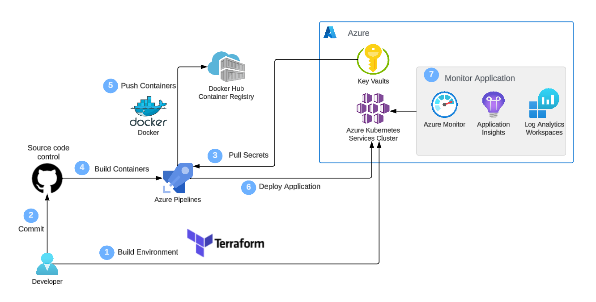
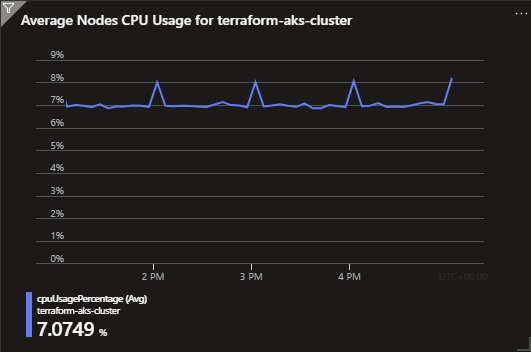
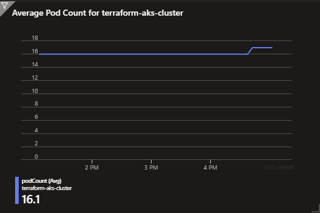
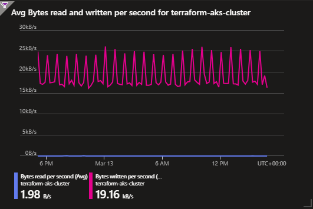

# Web-App-DevOps-Project

Welcome to the Web App DevOps Project repo! This application allows you to efficiently manage and track orders for a potential business. It provides an intuitive user interface for viewing existing orders and adding new ones.

## Table of Contents

- [Features](#features)
- [Getting Started](#getting-started)
- [Technology Stack](#technology-stack)
- [Architecture](#architecture)
- [Creating an Azure End-to-End DevOps Pipeline](#creating-an-azure-end-to-End-devOps-pipeline)
  - [Delivery Date Feature: Addition and Reversion](#delivery-date-feature-addition-and-reversion)
  - [Containerisation Process using Docker](#containerisation-process-using-docker)
  - [Defining Networking- ervices with Terraform](#defining-networking-services-with-terraform)
  - [Defining an AKS Cluster with IaC](#defining-an-aks-cluster-with-iac)
  - [Creating an AKS Cluster with IaC](#creating-an-aks-cluster-with-iac)
  - [Kubernettes Deployment to AKS](#kubernettes-deployment-to-aks)
  - [CI/CD Pipeline with Azure DevOps](#ci/cd-pipeline-with-azure-devops)
  - [AKS Cluster Monitorings](#aks-cluster-monitoring)
  - [AKS Integration with Azure Key Vault for Secrets Management](#aks-integration-with-azure-key-vault-for-secrets-management)
- [Image Information](#image-information)
- [Contributors](#contributors)
- [License](#licence)

## Features

- **Order List:** View a comprehensive list of orders including details like date UUID, user ID, card number, store code, product code, product quantity, order date, and shipping date.
  


- **Pagination:** Easily navigate through multiple pages of orders using the built-in pagination feature.
  


- **Add New Order:** Fill out a user-friendly form to add new orders to the system with necessary information.
  


- **Data Validation:** Ensure data accuracy and completeness with required fields, date restrictions, and card number validation.

## Getting Started

### Prerequisites

For the application to succesfully run, you need to install the following packages:

- flask (version 2.2.2)
- pyodbc (version 4.0.39)
- SQLAlchemy (version 2.0.21)
- werkzeug (version 2.2.3)

### Usage

To run the application, you simply need to run the `app.py` script in this repository. Once the application starts you should be able to access it locally at `http://127.0.0.1:5000`. Here you will be meet with the following two pages:

1. **Order List Page:** Navigate to the "Order List" page to view all existing orders. Use the pagination controls to navigate between pages.

2. **Add New Order Page:** Click on the "Add New Order" tab to access the order form. Complete all required fields and ensure that your entries meet the specified criteria.

## Technology Stack

- **Backend:** Flask is used to build the backend of the application, handling routing, data processing, and interactions with the database.

- **Frontend:** The user interface is designed using HTML, CSS, and JavaScript to ensure a smooth and intuitive user experience.

- **Database:** The application employs an Azure SQL Database as its database system to store order-related data.

- **Deployment:**
  - **Containerisation:** This application uses Docker for containerisation to offer a flexible and consistent deployment solution.
  - **Distribution:** This application uses Docker Hub for distribution.
  - **Infrastructure as Code (IaC):** This application uses Terraform for IaC.
  - **Deployment automation, scaling, and management of containerised application:** This application uses Kubernetes (K8s) for deployment automation, scaling, and management of containerisation.

## Architecture



## Delivery Date Feature: Addition and Reversion

### Changes Made
1. Addition of Delivery Date Feature<br>
   - **Files Modified:** 'app.py' and templates\template.html.

   - **Description:** The delivery date feature was added to enhance the functionality of the web app.
     The feature aimed to display the expected delivery date for orders placed through the app. 

   - **Implementation Details:**  In 'app.py' and template.html, delivery date was added.
  
2. Reversion of Delivery Date Feature<br>
   - **Files Modified:** 'app.py' and templates\template.html.

   - **Description:** Due to unforeseen complications or changes in project requirements, the delivery date feature was reverted.

   - **Reason for Reversion:** No longer necessary in the backend database.
   - **Action Taken:** In 'app.py', the code related to delivery date was removed. In template.html, any HTML elements or code related to displaying the delivery date were removed.

## Containerization Process using Docker
### Steps to Containerize the Application
1. **Identify Application Dependencies:**
   - List all the dependencies required for the application to run.
  
2. **Create Dockerfile:**
   - Define Dockerfile which specifies the environment and dependencies to run the application.
   - Example Dockerfile:
     ```
      FROM python:3.9
      WORKDIR /app
      COPY requirements.txt .
      RUN pip install -r requirements.txt
      COPY . .
      CMD ["python", "app.py"]

     ```
     
3. **Build Docker Image:**
   - Use the Docker build command to create a Docker image based on the Dockerfile.
   - Example: 

     ```
      docker build -t myapp .
     ```
 
4. **Run Docker Container:**
   - Start a Docker container using the built image.
   - Example: 
     ```
     docker run -d -p 8080:80 myapp
     ```

### Docker Commands Usage
1. **Building Docker Image:**
    - Build a Docker image based on the Dockerfile in the current directory:
    ```
      docker build -t <image_name> .
    ```
      - '-t': Tag the image with a name.
 
2. **Running Containers:**
    - Start a Docker container in detached mode, mapping a host port to a container port:
      ```
        docker run -d -p <host_port>:<container_port> <image_name> 
      ```
      - '-d': Run the container in detached mode.
      - '-p': Specify port mapping.

3. **Tagging Docker Images:**
    - Tag a Docker image to prepare it for pushing to a registry:
    ```
      docker tag <image_id> <username>/<repository>:<tag>
    ```
      - ID of the Docker image: <image_id>
      - New tag format: <username>/<repository>:<tag>

4. **Pushing Images to Docker Hub:**
    - Push a Docker image to Docker Hub:
      ```
        docker push <username>/<repository>:<tag>
      ```
      - Image reference with tag: '<username>/<repository>:<tag>'

## Image Information
  - **Image Name:** web-app-img
  - **Tags:** V1 (or latest)
  - **Instructions for Use:**
    - Run the container with docker run -d -p 5000:5000 web-app-img.
    - Access the application at http://localhost:5000.

## Defining Networking Services with Terraform
This documentation outlines the process of defining networking services using Infrastructure as Code (IaC) with Terraform. 
### Steps to provision the necessary networking services on Azure.
1. **Create Terraform Project and Modules:**
   - Create a project folder with a descriptive name for your Terraform project, such as **aks-terraform**.
   - The project should be organized into two Terraform modules:
       - **networking-module**: for provisioning the necessary Azure Networking Services for an AKS cluster
       - **aks-cluster-module**: for provisioning the Kubernetes cluster itself.
 
2. **Define the Network Module Input Variables:**
   - Inside the networking module directory create a **variables.tf** file. 
   - Define the following variables:
       - **resource_group_name** - The name of the Azure Resource Group where the networking resources will be deployed in. The variable should be of type string and have a default value.
       - **location** - Specifies The Azure region where the networking resources will be deployed to. The variable should be of type string and have a default value.
       - **vnet_address_space** - Specifies the address space for the Virtual Network (VNet). The variable should be of type list(string) and have a default value.
     
3. **Define Networking Resources and NSG Rules:**
   - Inside the networking module directory create a **main.tf** file and define the essential networking resources for an AKS cluster as follows. 
     - Azure Resource Group: Name this resource by referencing the **resource_group_name** variable created earlier
     - Virtual Network (VNet): **aks-vnet**
     - Control Plane Subnet: **control-plane-subnet**
     - Worker Node Subnet: **worker-node-subnet**
     - Network Security Group (NSG): **aks-nsg**
   - Within the NSG, define two inbound rules:
       - one to allow traffic to the kube-apiserver (named kube-apiserver-rule) and
       - one to allow inbound SSH traffic (named ssh-rule).
       - Both rules should only allow inbound traffic from your public IP address.
 
4. **Define the Networking Module Output Variables:**
   - Inside the networking module directory create a **outputs.tf** file 
   - Define the following output variables:
     - **vnet_id** - variable that will store the ID of the previously created VNet.
     - **control_plane_subnet_id** - variable that will hold the ID of the control plane subnet within the VNet.
     - **worker_node_subnet_id** - variable that will store the ID of the worker node subnet within the VNet.
     - **networking_resource_group_name** - variable that will provide the name of the Azure Resource Group where the networking resources were provisioned in.
     - **aks_nsg_id** - variable that will store the ID of the Network Security Group (NSG).
       
4. **Initialise the Newtworking Module:**
   - Initialise the networking module to ensure it is ready to use within your main project. 
   - 'terraform init'

## Defining an AKS Cluster with IaC
To provision an AKS (Azure Kubernetes Service) cluster using Infrastructure as Code (IaC), we've followed these steps:
1. **Define Input Variables:**
  - Create a variables.tf file inside the cluster module directory to define input variables.
  - These variables allow customisation of various aspects of the AKS cluster, including cluster name, cluster location, DNS prefix, Kubernetes version, service principal client ID, and service principal secret.
  - Additionally, include output variables from the networking module such as resource group name, VNet ID, AKS NSG ID, control plane subnet ID, and worker node subnet ID.

2. **Define the Cluster Resources:**
  - In the main.tf file within the cluster module directory, define Azure resources for provisioning the AKS cluster.
  - Create the AKS cluster, specifie the node pool, and define the service principal.
  - Use the input variables define in Task 1 to specify the necessary arguments.

3. **Define Cluster Module Output Variables:**
  - Create an outputs.tf file inside the cluster module to define output variables capturing essential information about the provisioned AKS cluster.
  - Define output variables for AKS cluster name, cluster ID, and kubeconfig file.

4. **Initialise the Cluster:**
  - Initialise the cluster module to ensure it is ready to use within the main project.
  - Use the terraform init command in the cluster module directory.

5. **Documentation:**
  - Update the README file in the project repository to document the process of provisioning an AKS cluster using IaC.
  - Include steps taken to define the cluster and documented the input and output variables used in this module.

## Creating an AKS Cluster with IaC
1. **Define Project Main Configuration:**
  - Create a main.tf file in the aks-terraform directory.
  - Define Azure provider block for authentication using service principal credentials.
  - Ensure sensitive information like client_id and client_secret are stored securely using input variables and environment variables.

2. **Integrate the Networking Module**
  - Integrate networking module to include networking resources like virtual networks and subnets.
  - Specify input variables:
    - resource_group_name: Descriptive name for the networking resource group.
    - location: Azure region for deployment.
    - vnet_address_space: Address space for the virtual network.

3. **Integrate the Cluster Module**
  - Integrate the cluster module in the main project configuration file.This step connects the AKS cluster specifications to the main project, as well as allowing you to provision the cluster within the previously defined networking infrastructure.
  - Define input variables:
    - cluster_name: Name for the AKS cluster.
    - location: Azure region for deployment.
    - dns_prefix: DNS prefix for the AKS cluster.
    - kubernetes_version: Supported Kubernetes version.
    - service_principal_client_id 
    - service_principal_secret: Service principal credentials.
  - Use output variables from the networking module for other required input variables.
    - resource_group_name
    - vnet_id
    - control_plane_subnet_id
    - worker_node_subnet_id 
    - aks_nsg_id
     
4. **Apply the Main Configuration**
  - Initialise Terraform in the project directory.
  - Apply the Terraform configuration to create the infrastructure.
  - Ensure secrets are ignored by adding resultant state file to .gitignore.
   
5. **Access the AKS Cluster**
  - Once provisioned, retrieve the kubeconfig file.
  - Use the Azure CLI to get the AKS cluster credentials.
    **az aks get-credentials --resource-group <your-resource-group> --name <your-aks-cluster-name>
  - Connect securely to the AKS cluster to verify successful provisioning and operational status.
  - Check the status of your nodes you can run kubectl get nodes.

6. **Documentation**
  - Create detailed documentation explaining main configuration, provider setup, and module integration.
  - Clarify usage of input variables.
  - Update the README file in the GitHub repository with the revised documentation.

## Kubernettes Deployment to AKS

**1. Deployment and Service Manifests**
  **Deployment Manifest**:
- Create a Kubernetes manifest file named `application-manifest.yaml`.
- Define a Deployment named `flask-app-deployment` to deploy the containerized web application.
- Specifie two replicas for scalability and high availability.
- Used labels (`app: flask-app`) to uniquely identify the application and its pods.
- Configure the manifest to use the container image hosted on Docker Hub.
- Expose port 5000 for communication within the AKS cluster.
- Implement Rolling Updates deployment strategy for seamless updates.

  **Service Manifest**:
- Add a service named `flask-app-service` for internal communication within the AKS cluster.
- Align selector with the labels of Deployment pods (`app: flask-app`).
- Configure the service to use TCP protocol on port 80, with targetPort set to 5000.
- Set the service type to ClusterIP for internal service within the AKS cluster.

**2. Deployment Strategy**
- Chose the Rolling Updates deployment strategy to ensure seamless application updates while maintaining availability. 
- This strategy allows one pod to deploy while another remains available, minimising downtime and ensuring continuous service availability. 
- It aligns with our application's requirements for reliability and scalability.

**3. Testing and Validation**
  
**Testing Process**:
- Verify the status and details of pods and services within the AKS cluster.
- Initiate port forwarding to a local machine using `kubectl port-forward <pod-name> 5000:5000`.
- Accessed the web application locally at http://127.0.0.1:5000.
- Thoroughly test the functionality, particularly focusing on the orders table and Add Order functionality.
   
**Validation**:
- Ensured that the pods were running and services were correctly exposed.
- Confirmed the functionality and reliability of the application within the AKS cluster.

**4. Distribution Plan**
  
**To distribute the application to other internal users:**
- Implement an Ingress controller to expose the application securely to internal users without relying on port forwarding.
- Utilise Kubernetes RBAC (Role-Based Access Control) to manage access permissions within the cluster.
- Provide documentation and training sessions for internal users on accessing the application via the established Ingress endpoint.

**For external users:**
- Utilise a secure Azure Application gateway or load balancer to expose the application securely.
- Implement HTTPS with SSL certificates for encrypted communication.
- Implement authentication and authorisation mechanisms, such as Azure Entra ID and RBAC, to ensure secure access based on roles.
- Regularly update security configurations and monitor access logs for potential vulnerabilities.

## CI/CD Pipeline with Azure DevOps

1. **Azure DevOps Project Setup**
  - Create a new Azure DevOps project within the Azure DevOps account. 
  - Log into Azure DevOps with the same email account that's associated with the Azure account.

2. **Azure DevOps Pipeline Initialization**
  - Configure the source repository for the pipeline using GitHub.
  - Select the repository containing the application code.
  - Create the pipeline using a Starter Pipeline template for further customisation.

3. **Azure DevOps-Docker Hub Connection**
  - Set up a service connection between Azure DevOps and the Docker Hub account, facilitating the seamless integration of the CI/CD pipeline with the Docker Hub container registry as follows:
    - Create a personal access token on Docker Hub.
    - Configure an Azure DevOps service connection utilising the Docker Hub token.
    - Successfully establish the connection between Azure DevOps and Docker Hub.

4. **Pipeline Configuration for Docker Image Build and Push**
  - Modify the configuration of your pipeline to enable it to build and push a Docker image to Docker Hub. Follow these steps:
    - Add Docker task with the buildandPush command to the pipeline.
    - Configure the pipeline to trigger on each push to the main branch.
    - Run the pipeline and test the Docker image functionality locally. 

5. **Azure DevOps-AKS Connection Establishment**
  - Create and configure an AKS service connection within Azure DevOps.
  - Establish a secure link between the CI/CD pipeline and the AKS cluster.

6. **Pipeline Configuration for Kubernetes Deployment**
  - Modify the CI/CD pipeline to incorporate the Deploy to Kubernetes task with the deploy kubectl command.
  - Leverage the deployment manifest available in the application repository.
  - Utilise the established AKS connection for automatic deployment to the AKS cluster.

7. **Testing and Validation of CI/CD Pipeline**
  - Monitor the status of pods within the AKS cluster to confirm correct creation.
  - Initiate port forwarding using kubectl to securely access the application running on AKS.
  - Test the functionality of the application to ensure correct operation, validating the CI/CD pipeline effectiveness.

## AKS Cluster Monitoring

1. **Enable Container Insights for AKS**
   - Navigate to AKS cluster resource.
   - Select **Monitoring** from the left-hand menu.
   - Click Enable **Container Insights**.
   - Follow the prompts to enable Container Insights, ensuring Managed Identity is enabled on the cluster and necessary permissions are set for the Service Principal.
   - Use following command to enable managed identity on the AKS cluster. 
    ```
     az aks update -g {resource-group-name} -n {aks-cluster-name} --enable-managed-identity
     ```
2. **Create Metrics Explorer Charts**
   - Navigate to AKS cluster resource.
   - Select **Monitoring** from the left-hand menu.
   - Click **Metrics Explorer**.
   - Add charts for:
     - Average Node CPU Usage
     
     - Average Pod Count
     
     - Used Disk Percentage
     
     - Bytes Read and Written per Second
     
3. **Log Analytics Configuration**
Configure Log Analytics to execute and save the following logs:

   - **Average Node CPU Usage Percentage per Minute**: This configuration captures data on node-level usage at a granular level, with logs recorded per minute

   - **Average Node Memory Usage Percentage per Minute**: Similar to CPU usage, tracking memory usage at node level allows you to detect memory-related performance concerns and efficiently allocate resources

   - **Pods Counts with Phase**: This log configuration provides information on the count of pods with different phases, such as Pending, Running, or Terminating. It offers insights into pod lifecycle management and helps ensure the cluster's workload is appropriately distributed.

   - **Find Warning Value in Container Logs**: By configuring Log Analytics to search for `warning` values in container logs, you proactively detect issues or errors within your containers, allowing for prompt troubleshooting and issues resolution


   - **Monitoring Kubernetes Events**: Monitoring Kubernetes events, such as pod scheduling, scaling activities, and errors, is essential for tracking the overall health and stability of the cluster

4. **Set Up Disk Used Percentages Alarm**
   - Navigate to AKS cluster resource.
   - Select **Monitoring** from the left-hand menu.
   - Click **Alerts**.
   - Configure an alert rule to trigger when used disk percentage exceeds 90%, with check interval of 5 minutes and loopback period of 15 minutes. Set email notifications for alarm triggers.
    
5. **Modify CPU and Memory Alert Rules**
   - Navigate to AKS cluster resource.
   - Select **Monitoring** from the left-hand menu.
   - Click **Alerts**.
   - Adjust existing alert rules for CPU and memory to trigger when they exceed 80%.

## AKS Integration with Azure Key Vault for Secrets Management
This Section outlines the steps required to integrate Azure Kubernetes Service (AKS) with Azure Key Vault for secure secrets management within your application. By leveraging Azure Key Vault, sensitive information such as database credentials can be securely stored and accessed by your application running on AKS.

1. **Creating an Azure Key Vault**

  Begin by creating an Azure Key Vault where sensitive information will be securely stored.

  ```
    az keyvault create --name <key-vault-name> --resource-group <resource-group-name> --location <location>
  ```

2. **Assign Key Vault Administrator Role**

  Assign the Key Vault Administrator role to your Microsoft Entra ID user to grant necessary permissions for managing secrets within the Key Vault.

  ```
    az keyvault set-policy --name <key-vault-name> --upn <user-email> --secret-permissions get list set delete --resource-group <resource-group-name>
  ```

3. **Create Secrets in Key Vault**

  Create secrets in the Key Vault for storing sensitive credentials used within the application, including server name, username, password, and database name.

4. **Enable Managed Identity for AKS**

  Enable managed identity for the AKS cluster to allow it to authenticate and interact securely with the Key Vault.

    - Launch a command-line interface on your local machine. Sign in to your Azure account using the Azure CLI.

      ```
        az aks update --resource-group <resource-group> --name <aks-cluster-name> --enable-managed-identity
      ```
    - Execute the following command to get information about the managed identity created for the AKS cluster:
    ```
      az aks show --resource-group <resource-group> --name <aks-cluster-name> --query identityProfile
    ```
    Make a note of the **clientId** under **identityProfile** for later use.   

5. **Assign Permissions to Managed Identity**

  Assign the Key Vault Secrets Officer role to the managed identity associated with AKS to enable it to retrieve and manage secrets.

  - Assign "Key Vault Secrets Officer" role to Managed Identity
    
    ```
        az role assignment create --role "Key Vault Secrets Officer" \
           --assignee <managed-identity-client-id> \
           --scope /subscriptions/{subscription-id}/resourceGroups/{resource-group}/providers/Microsoft.KeyVault/vaults/{key-vault-name}
    ```

6. **Update the Application Code**

  - Integrate Azure Identity and Azure Key Vault libraries into the Python application code to enable communication with Azure Key Vault.
  - Modify the code to use managed identity credentials, ensuring secure retrieval of database connection details from the Key Vault.
  - Ensure you have the following libraries installed:

    ``` pip install azure-identity
        pip install azure-keyvault-secrets   
    ```
  - By incorporating the Azure Identity and Azure Key Vault libraries, coupled with the Azure Key Vault - AKS integration set up above, your AKS-hosted Python applications gain the capability of accessing secrets stored in Azure Key Vault. 
  - This approach replaces the need for hard-coding sensitive information within your application, introducing a more secure and dynamic credential management strategy.

7. **End-to-End Testing AKS**

  Deploy the modified application to the AKS cluster using Azure DevOps CI/CD pipeline. Conduct end-to-end testing within the AKS environment to validate the functionality, including secure access to Key Vault secrets.


   
## Contributors 

- [Maya Iuga]([https://github.com/yourusername](https://github.com/maya-a-iuga))

## License

This project is licensed under the MIT License. For more details, refer to the [LICENSE](LICENSE) file.
